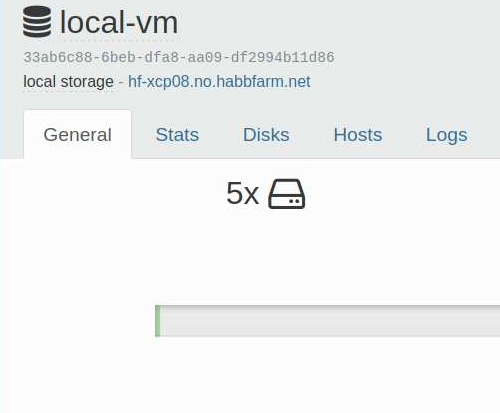

# Deploy vm with terraform on xen orchestra


This terraform repo you can deploy vm with cloud-init to xen orchestra with xcp-ng.


### What do you need.

First a template with cloud-init installed


Packages to install.
```
cloud-init
cloud-guest-utils
resolvconf
```

And you may need to enable cloud-init service.
```
systemctl enable cloud-init
```

Here are [ubuntu cloud images](https://cloud-images.ubuntu.com/) that you can use.
Select the OVA file and go the Import tab on xen orchestra server.


### How to use.

Install terraform.

Then clone this to place that con reach xen orchestra server.
```
git clone https://github.com/habbis/terraform_xenorchestra_vm_deploy.git
```

Have a user ready on xen orchestra that can deploy a vm.


```
cd terraform_xenorchestra_vm_deploy

terraform init

```

Add all the right info in variables.tf.

Then add the right info to terraform.auto.tfvars 

Then test and so deploy.
```
# testing before deploy and to see changes.
terraform plan

# deploy
terraform apply
```


### terraform config layout


#### main.tf

The file main.tf have provider version info and provider login info no more
no less .


#### variables.tf

All variables are placed here on thing of note is type = map(any)
this is used with terraform.auto.tfvars and for_each to have more
flexbile variable layout.

```
# for terraform.auto.tfvars
variable "deploy_vm" {

  type = map(any)

  default = {}
}

```

#### terraform.auto.tfvars

used with terraform.auto.tfvars and for_each to have more flexbile variable layout.

Here i define a new vm to deploy under deply_vm.


```
deploy_vm = {
# RAM
# 1073733632 1G ram
# 2073733632 is 2G ram
# 4294967296 is 4G ram
# disk
# 150000 is 15G
# storage id for local-vm host hf-xcp08
#  33ab6c88-6beb-dfa8-aa09-df2994b11d86
  test01 = {
    "name"                  = "test01"
    "vm_template"           = "deb11-tmpl-vm"
    "tag_os"                = "debian"
    "tag_os_release"        = "bullseye"
    "ram"                   = "1073733632"
    "cpu"                   = "1"
    "disk"                  = "16106127360"
    "sr_id"                 = "33ab6c88-6beb-dfa8-aa09-df2994b11d86"
    "network"               = "test"
    "ipv4"                  = "10.0.0.10/24"
    "ipv4_gw"               = "10.0.0.1"
    "dns01"                 = "8.8.8.8"
    "dns02"                 = "1.1.1.1"
    "zone"                  = "local.net"

   }
}
```

#### cloud-init config.


The file cloud_config.tftpl is a terraform template with [cloud-init](https://cloudinit.readthedocs.io/en/latest/topics/format.html) system config.

```
#cloud-config
hostname: ${name}
user: ansible
ssh_authorized_keys:
  - ssh-rsa yoursshkey
  - ssh-rsa yoursshkey
manage_etc_hosts: localhost
fqdn: ${name}.${zone}
package_upgrade: true
users:
 - default
  # to encrypt password mkpasswd -m sha-512
 - passwd: yourpasswordhash
# resize root files system
# its best to setup server with filesystem not lvm when using this.
resize_rootfs: true
growpart:
  mode: auto
  devices: ['/']
  ignore_growroot_disabled: false
packages:
 - gnupg 
 - bash-completion
 - curl
 - wget
 - python3
 - python3-pip
 - git
 - vim
 - lvm2
 - xe-guest-utilities
 - sudo
 - openssh-server
 - cloud-init
 - cloud-guest-utils
runcmd:
  - [sytemctl, enable, --now, xe-linux-distribution]
```

The file cloud_network_config.tftpl is a terraform template with [cloud-init network v1 config](https://cloudinit.readthedocs.io/en/latest/topics/network-config-format-v1.html).

```
#cloud-config
version: 1
config:
    - type: physical
      name: eth0
      subnets:
      - type: static
        address: '${ipv4}'
        gateway: '${ipv4_gw}'
        dns_nameservers:
          - ${dns01}
          - ${dns02}
        dns_search:
          - local.net
```


##### vm.tf

Here is the terraform config to deploy a vm.


This config is the terraform template to setup cloud-init for 
xen orchestra.

```
    cloud_config = templatefile("cloud_config.tftpl", {
     name = each.value.name
     zone = each.value.zone

    })
    cloud_network_config = templatefile("cloud_network_config.tftpl", {
     ipv4 =  each.value.ipv4
     ipv4_gw =  each.value.ipv4_gw
     dns01   =  each.value.dns01
     dns02   =  each.value.dns02
    })
```


Tips and tricks.

To find sr id for a storage volume go to.

Home --> Storage --> yourstorage


Here is a example you will see a string like this in a corner.

```
33ab6c88-6beb-dfa8-aa09-df2994b11d86
```




